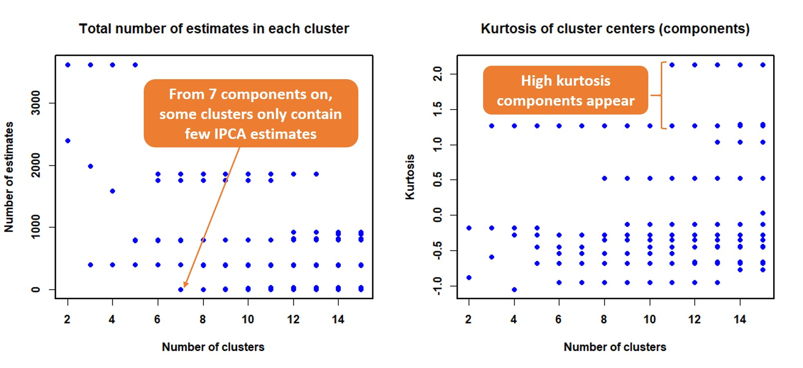
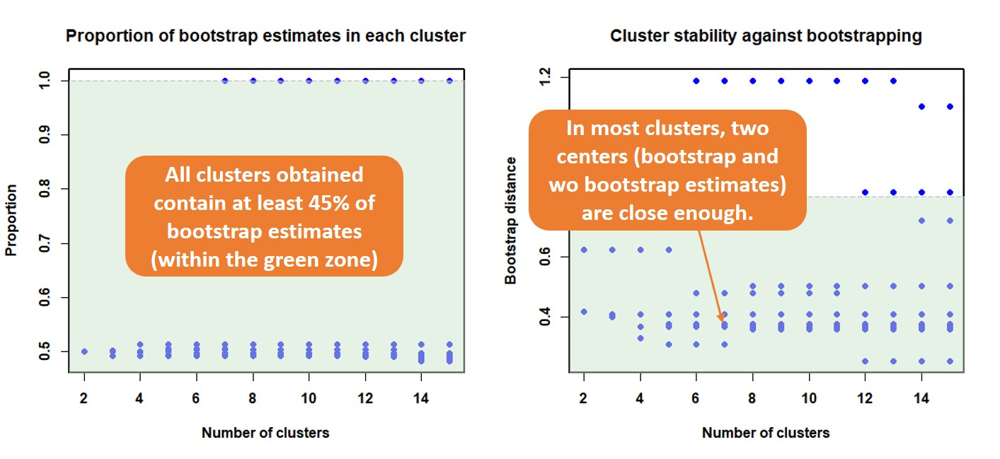
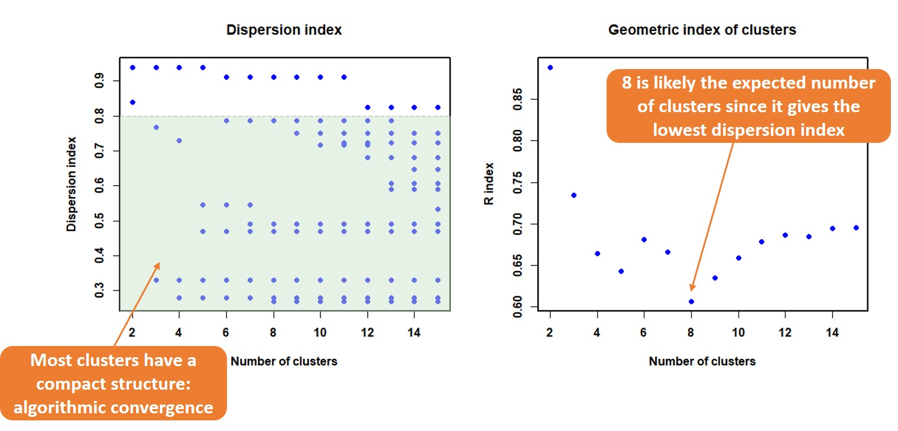
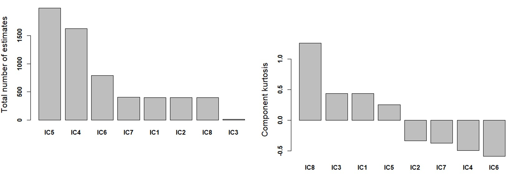
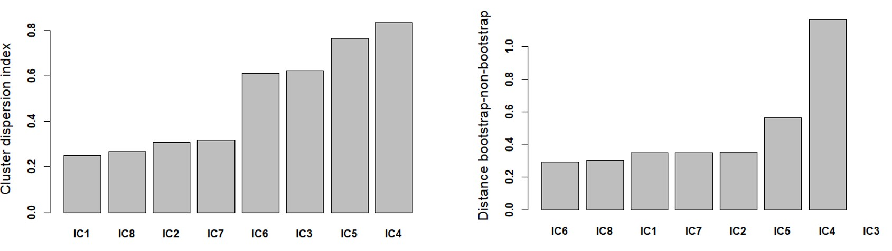
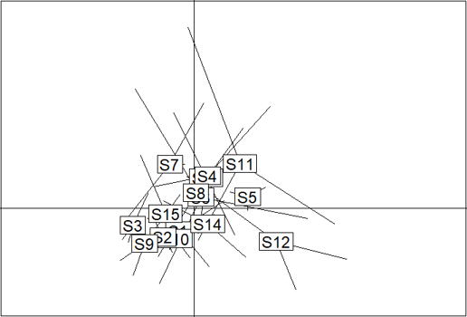

# MetICA: Independent component analysis for high-resolution mass-spectrometry based metabolomics

## Context
ICA is an important alternative to classical statistical approaches for non-targeted metabolomics data. It extends the concept of regular correlation (e.g. in PCA, ASCA and PLS-DA) to statistical dependance by capturing higher order dependencies. However, its algorithm instability (output variations between different algorithm runs) and the biological validity of components have been overlooked when applied to complex metabolomics data. MetICA adresses these problems by gathering ICs estimated from multiple algorithm runs and from bootstrapped datasets, clustering them so as to find the most representative components. While evaluating the algorithmic stability, MetICA also suggests multiple criteria to select the correct number of components and to rank the extracted components.

## Install devtools (only if it has not been installed)

Make sure you have a working development environment:
* Windows: Install Rtools.
* Mac: Install Xcode from the Mac App Store.
* Linux: Install a compiler and various development libraries (details vary across different flavors of Linux).

```R
install.packages("devtools")
```

## Installation from Github using R (with devtools)

```R
library(devtools)
install_github("daniellyz/MetICA2")
library(MetICA)
```

## Check the function manuals before starting

```R
help(MetICA)
help(validationPlot)
help(MetICA_extract_model)
```

## An example of data analysis using MetICA

### Load yeast metabolomics data:

```{r}
data(yeast_metabolome) 
# Check what is inside the example data:
yeast_metabolome$features[1:10,]  # Display metabolic features (m/z values and ids)
yeast_metabolome$X[1:10,1:10] # Display the head of samples x metabolic features data matrix
X = yeast_metabolome$X
```
### Also possible to load example data from .csv file:

```{r}
yeast_metabolome = read.csv("https://raw.githubusercontent.com/daniellyz/MetICA2/master/inst/Yeast-metabolome.csv")
features = yeast_metabolome[,c("ID","Mass")]
X = yeast_metabolome[,3:ncol(yeast_metabolome)] # Only keep intensity data for MetICA
rownames(X) = features$ID
X = t(X) # Transpose the data since MetICA accepts samples x variables matrices
```

### Run MetICA simulations:

```{r}
# Begin a MetICA simulation with 2000 estimated components in total. The samples are not time-dependent, so trend = FALSE. Numbers of clusters are evaluated between 2 and 15:
M1=MetICA(X,pcs = 10,max_iter = 400,boot.prop = 0.3,max.cluster = 15,trends = F)
```
The function will display the percentage of variance explained based on the number of pcs chosen. User can modify this value: 


### Some plots to decide the number of MetICA components:

```{r}
results=validationPlot(M1)
```
* Left plot: Clusters that only contain few random estimates are likely generated by chance and might not represent algorithm convergence. Small size clusters (fewer than 20 estimates) appeared at 7 components.  
* Right plot: Kurtosis of cluster centers (extracted MetICA components). High kurtosis components (bigger than 1) usually have heavy residuals. Here such component appeared at 11 components, and it can be informative especially when you are investigating outliers.



* Left plot: Higher percentage of bootstrapping-generated estimates indicate the biological validity of the cluster. Cluster with higher than 45\% bootstrapping estimates are considered "safe" (in the green zone). In this example, all components were in the safe zone. 
* Right plot: The distance between centers of bootstrapping and without-bootstrapping estimates is measured. A distance smaller than 0.8 (in the green zone) means that the cluster is stable towards bootstrapping, and can be considered reliable. We observe here that an unreliable cluster appeared at ics = 6, and another appeared at ics = 12.



* Left plot: A geometric index is used to measure how compact is each cluster. The green zone shows a compact cluster and a good algorithm convergence. In this example, almost all clusters were in the green zone from 12 clusters on.
* Right plot: If users cannot decide the optimal number of components (clusters) based on previous plots, we recommend a global dispersion index called R index (please set cluster_index = T to allow the calculation). Number of clusters with lowest R index indicate the best clustering quality, here ics = 8.   



### Extract the MetICA model

```{r}
# According to validation, we chose ics = 8 as optimal number of components.
M2=MetICA_extract_model(M1,ics = 8)
```
The function orders the extracted components using different criteria:

* Left plot: number of estimates used to generate each component. IC3 here represents a cluster with very few estimates, so it should not be prioitised for biological interpretations.
* Right plot: kurtosis of each component based on component scores. IC8 has higher kurtosis and might be informative.



* Left plot: compactness of each cluster. IC1, IC8, IC2 and IC7 showed the best convergence of algorithm.
* Right plot: stability of each cluster towards bootstrapping. IC6, IC8, IC1, IC7 and IC2 seem to be more reliable. 



### Biological interpretation

```{r}
library(ade4)
# Ploting 5th and 8th MetICA components:
s.class(M2$S[,c(1,8)], yeast_metabolome$strains,cellipse=0,cpoint=0,clabel=1.5,add.p=F,grid=F) 
```
Similar to the visualization of PCA scores, MetICA also allows the comparison of metabolic profiles. The following figure compares the metabolic profiles of 15 yeast strains (Biological replicates of the same strain is connected)  



If the separation on the first component matched with previous knowledges about yeast strains (e.g. phenotype separation), the variables (mass features) that have high loadings on this component might be potential biomarkers. To extract the top 100: 

```{r,eval=T}
top100=order(M2$A1[,1],decreasing=T)[1:100]
top100_loading=M2$A1[top100,1]
cbind( yeast_metabolome$features[top100,],Loadings=top100_loading)
```

### Collaborators


